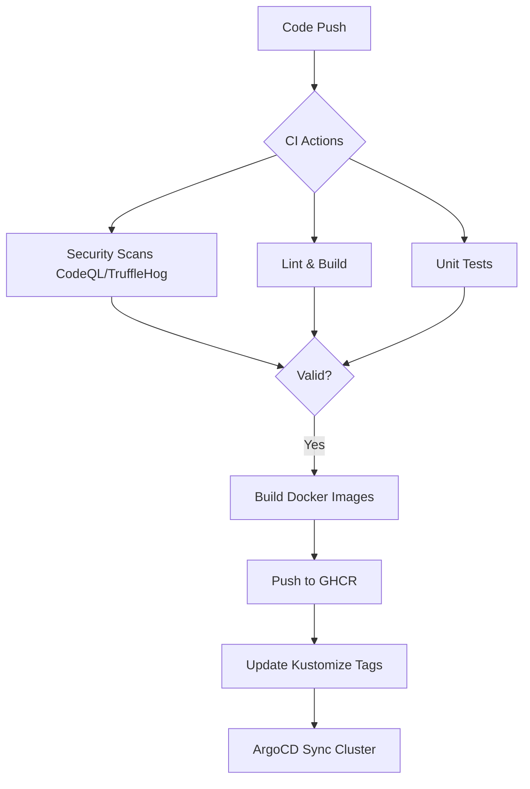

# Documentation du Pipeline CI/CD (SecDevOps)

Ce projet utilise [GitHub Actions](https://docs.github.com/en/actions) pour son intégration et son déploiement continus. Le pipeline a été conçu sur mesure pour notre architecture **Monorepo** afin d'être rapide, intelligent, et sécurisé.

## Processus de Livraison Continue (Workflow)

## Conformité et Intégration
Le pipeline est conforme aux exigences de production :
- **Isolation** : Chaque environnement (Dev, Staging, Prod) possède son propre overlay.
- **Auditabilité** : Chaque déploiement est lié à un commit Git tagué dans Kustomize.
- **Sécurisation** : Utilisation de **SealedSecrets** (ou Secrets K8s) pour ne jamais versionner de credentials en clair.

## Les 5 Piliers de notre CI/CD

### 1. 🎯 Monorepo Aware (Paths-Filter)
Le projet contenant plusieurs blocs distincts (Frontend, Services Backend, Infra), la CI ne lance les builds lourds et les tests **que sur les dossiers métier modifiés**.
Si vous ne modifiez que le `catalog-service`, les étapes relatives au front-end ou au `moderation-worker` seront ignorées.

### 2. 🔐 Sécurité "Shift-Left" (SecDevOps)
La sécurité est intégrée dès le commit de code :
- **TruffleHog (Secret Scanning)** : Analyse la Pull Request pour vérifier qu'aucun mot de passe, clé d'API, ou token n'a fuité.
- **CodeQL (SAST)** : Analyse le typage et le code en profondeur (TypeScript/JavaScript) à la recherche de vulnérabilités connues (Injections, XSS, etc.).
- **NPM Audit (SCA)** : Vérifie ponctuellement que les librairies externes utilisées (`node_modules`) n'ont pas de failles signalées (CVE) via npm scan.

### 3. 🧪 Qualité du Code
À chaque push, la CI lance en parallèle de l'analyse sécurité le standard du projet :
- `npm run lint` (ESLint/Prettier)
- `npm run test:unit` (Jest, Vitest...)
- `npm run test:integration` / `npm run test:e2e`
- `npm run build` (S'assure que le TypeScript compile correctement).

### 4. 🐳 Déploiement Continu vers GHCR
Les microservices (`catalog-service`, `moderation-worker`) disposent de leur propre étape de fabrication d'image Docker. 
Ce build est optimisé avec du **cache par couche** (layer caching `type=gha`) et l'image finale est poussée automatiquement vers le registre privé/public de GitHub : **GitHub Container Registry (GHCR)**.

### 5. 🌿 Gestion des Environnements (Tags Docker)
Les images Docker générées sont automatiquement taguées selon la branche source :
- Un *Push/Merge* sur la branche `dev` produira l'image `ghcr.io/.../mon-service:dev`.
- Un *Push/Merge* sur la branche `main` produira l'image `ghcr.io/.../mon-service:main` **ainsi que** le tag `latest`.

### 6. 🎡 Déploiement GitOps (Argo CD)
Une fois l'image poussée vers GHCR, notre workflow met à jour automatiquement les tags dans `infra/k8s/overlays/dev/kustomization.yaml`. **Argo CD** détecte ce changement et synchronise le cluster Kubernetes (`minikube`) de manière déclarative.

## Economie de ressources (Concurrency)
Si vous pushez plusieurs fois consécutivement sur une même Pull Request, le workflow annulera automatiquement les anciens runs en cours pour optimiser le temps d'exécution global et ne traiter que le dernier code envoyé.

## Comment déclencher les actions ?

- Ouvrir ou mettre à jour une **Pull Request** vers les branches `main` ou `dev` (Tests & Sécurité uniquement).
- Pusher ou Merger directement sur `main` ou `dev` (Tests, Sécurité + **Déploiement Continu GHCR**).

